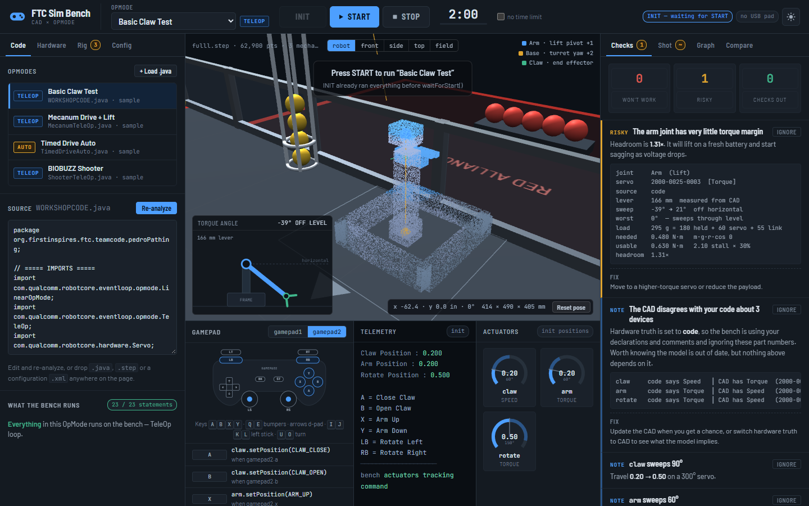
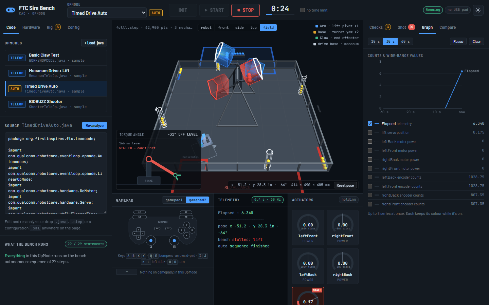
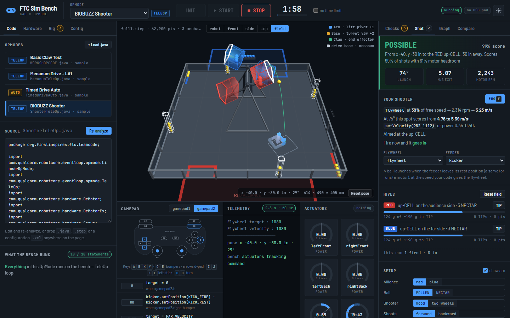

# FTC Sim Bench

**Drop in any FTC robot's STEP CAD and any OpMode. The bench resolves the assembly, runs your code on a virtual Driver Station — INIT, START, STOP — and lets you drive the result on the real 2026-27 BIOBUZZ field. Then it tells you what won't work before you find out at an event.**

**Live:** https://lilrino71.github.io/ftc-sim-bench/ — runs entirely in the browser; nothing is uploaded anywhere.
One-click demos: [shoot into the HIVE](https://lilrino71.github.io/ftc-sim-bench/?opmode=sample-shooter&pose=-40,-30,29&start=1&view=field&right=shot) · [autonomous on the field](https://lilrino71.github.io/ftc-sim-bench/?opmode=sample-auto&start=1&view=field&right=graph) · [mecanum TeleOp](https://lilrino71.github.io/ftc-sim-bench/?opmode=sample-mecanum&start=1&view=field) · [arm + claw](https://lilrino71.github.io/ftc-sim-bench/?opmode=sample-claw)



---

## What it catches

Real findings from real team code:

| Finding | Why it matters |
|---|---|
| **A `hardwareMap` name isn't in the robot configuration** | Load the Robot Controller's configuration `.xml` and every name is checked exactly — including capitalisation (`"FrontRight"` ≠ `"frontRight"`) and type (a `Servo` in code configured as a continuous-rotation servo). Each of these stops the OpMode during INIT. |
| **`sleep()` inside the TeleOp loop** | A LinearOpMode is one thread. `sleep(450)` freezes the drivetrain and every PID loop for ~22 cycles. |
| **The servo can't hold the arm** — `0.42 N·m usable vs 0.48 N·m needed` | Lever measured from the CAD, servo spec from the part number or your code comment, worst case where the arm sweeps through horizontal. Press the button and the arm jams partway, just like on the robot. |
| **Code and CAD disagree about which servo is which** | The comment says *torque servo*; the STEP assembly has the *speed* variant bolted on. |
| **A button wired to an empty block**, **a mirrored pair set the same way round**, **a missing minus on `left_stick_y`** | Small things that cost a match. |
| **Lines the bench can't simulate** | Reported by line number with a reason (`follower.update()`, a `for` loop inside the loop) — never silently skipped. |

## What you can do with it

- **Driver Station flow.** Pick an OpMode, INIT runs everything before `waitForStart()`, START runs the loop, STOP drops motor power. TeleOp gets a 2:00 match clock, Autonomous 0:30.
- **Autonomous runs in order.** `sleep()` and wait loops hold the sequence while simulated time passes. `RUN_TO_POSITION`, `isBusy()`, `ElapsedTime` and `getRuntime()` behave as they do on the robot.
- **Drive it on the real field.** An on-screen gamepad (both `gamepad1` and `gamepad2`), the keyboard, or a real USB controller. Tank and mecanum drivetrains drive the measured BIOBUZZ field — 141 in between the walls, 23.5 in tiles — and stop against the walls, the HIVE legs and foot bars, and the FLOWERs. Field-centric code reads the simulated IMU. The field view is the drivers' view from your alliance station.
- **Shoot from your code.** Name a motor `flywheel` / `shooter` / `launcher` and a servo or motor `kicker` / `feeder` / `indexer` (or pick them in the Shot tab). When the feeder moves, a ball leaves at the speed your `setVelocity()` or `setPower()` gave the flywheel, from where the robot is, pointing where it points. It flies with drag and spin, and goes in, clips the lip or falls short. Three POLLEN on the staged NECTAR TIP the HIVE, and the up-CELL swings to the other side.
- **Watch PID loops converge.** Encoders integrate from commanded power, so `getCurrentPosition()` feeds your own `PIDController` back. The Graph tab plots telemetry, servo positions, motor power and encoder counts.
- **Tune live.** `static` fields show up as config variables you can edit while the OpMode runs, the way FTC Dashboard exposes `@Config` fields.
- **Compare two versions** of a TeleOp control by control — the quickest way to see what changed between `teleop_v3` and `teleop_final`.
- **Own the rig.** Joint types, what carries what, pivots and hardware specs are an editable, portable ~1 kB document you can commit next to your OpMode.
- **Dark or light**, remembered between visits.



## The BIOBUZZ field and the Shot tab



The field is built from the [BIOBUZZ Shot Sim](https://github.com/LILRINO71/biobuzz-shot-sim)'s measured data — the leaning A-frame HIVEs, both bistable arms with their pentagonal CELLs, the four FLOWERs on the walls, LOADING ZONES, GARDENS, alliance areas, and every staged POLLEN and NECTAR. The same engine does the shot physics, vendored in `vendor/biobuzz-shot-sim` (`npm run sync-shot-sim` refreshes it).

The **Shot** tab answers the questions a team has while writing the shooter code:

- **Can you score from here?** POSSIBLE / NOT CONSISTENT / WON'T WORK for the robot's current spot, with the launch angle, exit speed and motor rpm the best shot needs.
- **What should the code command?** With your fixed hood angle, the band of exit speeds that score from this spot — as `setVelocity(…)` ticks per second and as a power.
- **Is the robot aimed?** How many degrees to turn, and whether a ball fired right now goes in. The arc in 3D shows it: solid green or red for your shot as it stands, dashed for the best one from here.
- **What's in the HIVEs?** Grams in each up-CELL against the ~190 g it takes to TIP, TIPs and points. Buttons fire by hand (<kbd>F</kbd>), TIP a HIVE, or reset the field. INIT resets it too, like the field crew between matches.

Link to a spot: `?pose=-40,-30,29` puts the robot at x −40 in, y −30 in, heading 29°; `?alliance=blue` switches sides.

## How it works

The idea that makes it work across thousands of different robots: **separate what the files state from what has to be guessed.**

**Facts — parsed, never guessed.**
- **STEP (ISO 10303-21)**: entity graph, product tree, units and assembly transforms. Most exports store each part in its own coordinates and place it with the assembly, so the bench walks the occurrence tree and applies the transforms. The record splitter is string- and comment-aware and linear-time on 50 MB files.
- **Java OpMode**: parsed into a statement tree with a real expression grammar — precedence, ternaries, booleans, `Math.*`, `Range.clip`, `x++` — and **interpreted**, not pattern-matched. Rising-edge latches, stick mixing, field-centric drive and PID all behave the way they do on the robot.
- **Robot configuration `.xml`**: devices, hubs, ports and types.

**Guesses — seeded automatically, owned by you.** Which subassembly is a mechanism, what kind of joint it is, what carries what, which device maps where. None of that is in a STEP file — Onshape exports no kinematics — so no amount of tuning makes it reliable. The bench drafts it, marks every guess, and hands it to you to confirm.

## Built after studying

| Tool | What it does well | What the bench took from it |
|---|---|---|
| [virtual_robot](https://github.com/Beta8397/virtual_robot) (Beta8397) | Runs real OpModes against a 2D field, with explicit errors | The INIT / START / STOP flow, and reporting what can't run instead of failing silently |
| [Virtual Robot Simulator](https://www.vrobotsim.com/) | Browser-based, gamepad-driven TeleOp on the season field | A browser-only tool with a virtual gamepad |
| [FTC Dashboard](https://acmerobotics.github.io/ftc-dashboard/) | Live `@Config` variables, telemetry graphs | Live-editable config variables, and the telemetry graph |
| [AdvantageScope](https://github.com/Mechanical-Advantage/AdvantageScope) | Log viewer with line graphs and a 3D field | Hover readouts and small-multiple graphs — one y-axis per chart, not two |

## Run it

Open `docs/index.html` in a browser, or use the live link. To work on it:

```bash
npm run build           # src/ + vendor/ → dist/ftc-sim-bench.html, dist/preview.html, docs/index.html
npm test                # 45 tests, node --test, no dependencies
npm run sync-shot-sim   # refresh vendor/biobuzz-shot-sim from a checkout next to this one
```

Zero runtime dependencies beyond three.js (r128, from cdnjs) and Google Fonts; the Shot Sim engine is bundled in.

## Project layout

```
src/
  hardware.js     actuator database, part-number recognition, spec precedence (code vs CAD)
  samples.js      built-in robot and three sample OpModes
  step.js         STEP parser, assembly transforms, mechanism detection, the kinematic rig
  expr.js         expression grammar and evaluator
  java.js         OpMode → statement tree, bindings, coverage, config fields
  mapping.js      device ↔ mechanism matching, drivetrain detection
  robotconfig.js  Robot Controller configuration .xml: parse and check hardwareMap names
  compare.js      control-by-control diff of two OpModes
  analyze.js      findings
  field.js        the BIOBUZZ field: start poses, collisions, HIVE state, TIPs
  shots.js        shooter and feeder from the code, ball flight, the fixed-hood speed window
  sim.js          Driver Station lifecycle, 50 Hz interpreter, autonomous stepper, encoders, PID, chassis
  view3d.js       three.js field and articulated robot        (browser only)
  app.js          UI: tabs, gamepad, graph, rig editor, Shot tab, intake  (browser only)
vendor/biobuzz-shot-sim/   the Shot Sim engine and measured field data, with its source commit
tests/
  engine.test.mjs, features.test.mjs, field.test.mjs   run the real engine files in Node
  fixtures/        hand-written STEP assembly, competition-style OpMode, robot configuration
tools/build.mjs          single-file bundle for Pages and for sharing
tools/sync-shot-sim.mjs  copies the Shot Sim engine and data into vendor/
```

## Honest limits

- **Torque figures are estimates**: published stall torque, a lever measured from CAD, and a payload you set. They tell you which joint to go measure.
- **Don't tune PID gains here.** Motors have no inertia, gravity load or friction; use the bench to check *which way* a target drives a mechanism.
- The interpreter covers the constructs TeleOps and autonomous routines actually use; it does not compile arbitrary Java. Anything it can't run is listed with its line number.
- Calls into your own classes and path followers (Road Runner, Pedro Pathing) aren't simulated.
- Collisions use the robot's footprint from the CAD box, in 2-D: walls, HIVE legs and foot bars, FLOWERs. There are no other robots, and no intake — the robot never runs out of balls.
- The flywheel follows the commanded speed after the bench's usual motor slew; the dip after each shot and the spin-up time are in the Shot Sim's motor model, not the live run.

## License

MIT
